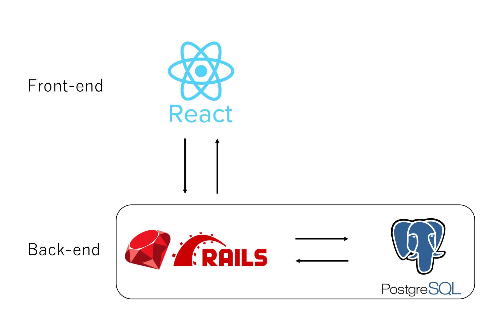

## 🤷‍♀️ About
Visualizes "Customer Reservations" with "Density"
## 🚀 Demo


## 🧐 Build With: React, Rails, Postgres



## 🛠️ Installation Steps

1. Clone the repository

```bash
git clone https://github.com/h1royuki229/Room-Management.git
```

2. Set up

```bash
docker-compose build
docker-compose run --rm back bundle exec rails db:setup
```

3. Run the app

```bash
docker-compose up -d
```

4. Stop the app

```bash
docker-compose down
```


## 🙏 Links
https://github.com/g1eb/reactjs-calendar-heatmap